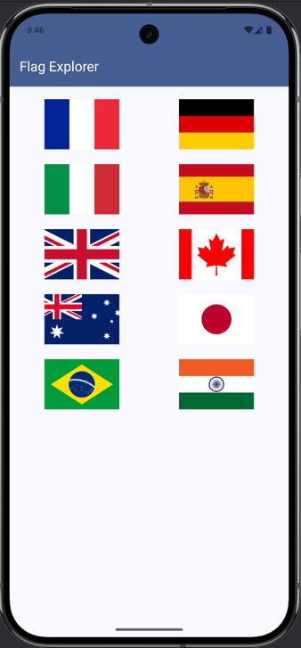
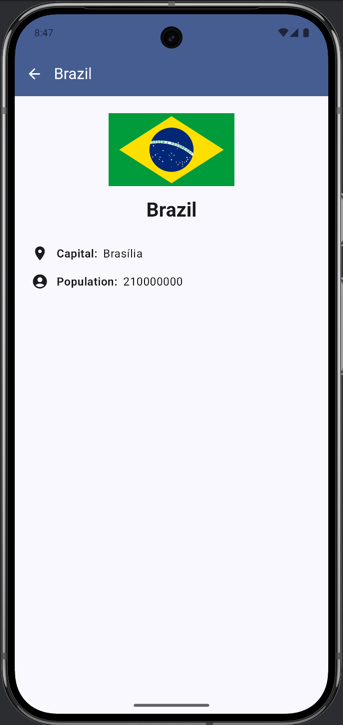

## FlagExplorer

FlagExplorer is a modern Android app built using Jetpack Compose, Kotlin, and Clean Architecture. It allows users to browse and learn details about countries around the world, including their flags, capitals, and population data.

---

## Features

- Browse a grid of country flags
- Tap to view detailed information (capital, population)
- Built with Jetpack Compose for responsive UI
- SVG image support with Coil
- Uses clean architecture: domain, data, and presentation layers
- ViewModel with state management via Kotlin Flows
- Unit and integration test support

---

## Architecture

This app follows Clean Architecture principles and includes:

- **Presentation Layer**: UI built with Jetpack Compose and ViewModel (state-driven)
- **Domain Layer**: UseCases and domain models
- **Data Layer**: API service (Retrofit), DTOs, and repository pattern
- **Dependency Injection**: Koin
- **Navigation**: Jetpack Compose Navigation

---

## Tech Stack

| Tech               | Usage                      |
|--------------------|----------------------------|
| Kotlin             | Language                   |
| Jetpack Compose    | UI                         |
| Retrofit           | Network calls              |
| Coil (SVG)         | Image loading              |
| Koin               | Dependency Injection       |
| Coroutine / Flow   | Asynchronous State         |
| Material 3         | Modern UI Components       |
| JUnit / MockK      | Testing                    |

---

## Testing

The app includes:

- Unit tests for UseCases
- Integration tests for ViewModels using FakeRepositories
- Mocks using MockK

To run tests:

```bash
./gradlew test
```

---

## UI Integration Tests
The project includes Jetpack Compose UI integration tests for critical user flows like loading states, error handling, and data rendering on key screens.

## Covered Screens
HomeScreen

Displays loading spinner

Shows country flag grid on success

Displays error message and retry button

DetailScreen

Displays loading spinner

Shows detailed country info (name, capital, population)

Handles error and allows retry

## Tools Used
Jetpack Compose Testing

AndroidX Test & JUnit

Espresso (for base instrumentation support)

## Testing Conventions
Each composable includes Modifier.testTag() on key UI elements for reliable querying during tests.

## Running Tests
Use Android Studio or run from terminal:

./gradlew connectedDebugAndroidTest

Alternatively, right click on androidTest and run all tests

---

## Getting started

### Prerequisites

- Android Studio Giraffe or later
- Android SDK 33 or above
- Internet connection (uses live REST API)

### Clone the repo

```bash
git clone https://github.com/yourusername/FlagExplorer.git
cd FlagExplorer
```

### Run the app

Open the project in Android Studio and click Run.

---

## Screenshots

### Home Screen



### Detail Screen



---

## License

This project is licensed under the MIT License.

---

## Acknowledgements

- REST Countries API
- Jetpack Compose
- Coil

## Firebase App Distribution
Firebase App Distribution is used to deliver debug builds of the app to testers quickly and securely.

How it Works
Every push to the master branch triggers a GitHub Actions CI pipeline.

The pipeline builds the debug APK.

The built APK is uploaded to Firebase App Distribution.

Testers receive an email with a link to download and install the app.

Configuration (CI/CD)
The Firebase distribution step is defined in .github/workflows/android-ci.yml using the wzieba/Firebase-Distribution-Github-Action action.

yaml
Copy
Edit
- name: Distribute APK via Firebase App Distribution
  uses: wzieba/Firebase-Distribution-Github-Action@v1
  with:
  appId: ${{ secrets.FIREBASE_APP_ID }}
  token: ${{ secrets.FIREBASE_TOKEN }}
  groups: testers
  file: app/build/outputs/apk/debug/app-debug.apk
  Testers
  Testers must be invited via Firebase Console or added to the tester group (testers).

They will receive an email with instructions to install the app via Firebase App Tester.

Secrets Required
In your GitHub repository, make sure the following secrets are configured under Settings > Secrets and variables > Actions:

FIREBASE_APP_ID – Found in Firebase project settings.

FIREBASE_TOKEN – Generated using firebase login:ci on your local machine.

## Author
Built by Sashen Govender